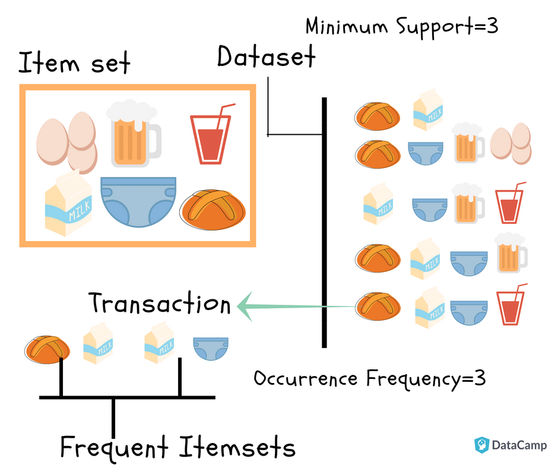

```{r setup, include=FALSE}
knitr::opts_chunk$set(echo = TRUE)
```

## HW BATCH #2 - Market Basket Analysis / Recommender Systems (a simple problem)
___
**I am assigning one simple problem on market basket analysis / recommender systems.**

**Imagine 10000 receipts sitting on your table. Each receipt represents a transcation with items that were purchased. The receipt is a representation of stuff that went into a customer's basket - and therefore 'Market Basket Analysis'.**

**That is exactly what the Groceries Data Set contains: a collection of receipts with each line representing 1 receipt and the items purchased. Each line is called a** $$transaction$$ **and each column in a row represents an** $item.$

**Here is the dataset =**[GroceryDataSet.csv](https://bbhosted.cuny.edu/bbcswebdav/pid-8461316-dt-announcement-rid-389564218_1/xid-389564218_1)**(comma separated file)**

**You assignment is to use R to mine the data for association rules. You should report support confidence and lift and your top 10 rules by lift. Turn in as you would the other problems from HA and KJ. You should packaged this with your HW#2 set.**

**NOTE: Bonus - Use a Python Library in addition to R and get a Bonus.**
___




The database contains customer transcations, 1000 receipts, that will be analyzed to predict customer's shopping trends and potentially provide bundle product recommendations with a more attractive price offer than buying the products individually.

For example, information can be extracted on consumer behavior like *If someone buys coffee and creamer, then is likely to buy cookies with high probability".


### Required Libraries (Python and RMarkdown)
```{r}
#Load required R language libraries
require(tidyverse)
require(arules) #mining association rules and frequent itemsets
require(arulesViz) #visualization techniques for association rules
require(lubridate) #work with dates and times
require(RColorBrewer) #graphics color
```


```{r}
#Installing Python Packages 
library(reticulate)
py_install("pandas")
py_install("mlxtend")
py_install("seaborn")
py_install("apyori")
```

### Load Dataset (Python) 

The data represents transcation data from a point of sales system on customer data.

```{python}
import pandas as pd
groc = pd.read_csv("GroceryDataSet.csv", header=None)
# Load data from a CSV file and hide the header
print("\nReading the CSV file (without header)...\n", groc.head(10))
```

```{python}
groc.shape
```

The data has 9835 observations (rows) recorded for 32 (columns) variables.


```{r message=FALSE, warning=FALSE}
#Explore the data structure
skimr::skim_without_charts(py$groc)
```


### Convert to a Transactional Dataset - Market Basket Analysis using R

Convert dataframe to a class `transactions` for perform association mining as follows:
```{r}
#Read the data as transcations class
grocery <- read.transactions("GroceryDataSet.csv", sep = ",", rm.duplicates = TRUE)
grocery
```


```{r}
summary(grocery)
```

**Frequency Plots**

Plots showing a transactions object most frequent, absolute and relative, items in the data base.
```{r}
#require(RColorBrewer)
```


```{r}
#Checking top 20 items sold in the dataset
itemFrequencyPlot(grocery,topN=20,type="absolute",col=brewer.pal(7,'Greens'),space=(0.5),width=(0.5),xlab="Item Name",ylab="Frequency(absolute)",main="Absolute Item Frequency Plot")
```


```{r}
#Again checking top 20 items sold in the given dataset with type=relative
itemFrequencyPlot(grocery,topN=20,type="relative",col=brewer.pal(8,'Spectral'),space=(0.5),width=(0.5),xlab="Item Name",ylab="Frequency(relative)",main="Relative Item Frequency Plot")
```


### Performing Apriori for Association Rules and Recommendation Rules

```{r}
#require(arules)
```

#### Market basket analysis KEY STEPs:

- Constructing associated rules

- Identifying items frequently purchased together


**Association Rules**

The associated rules explain the relationship of:
\n $$ \left\{ antecedent \right \} \rightarrow \left\{ consequent \right \}$$


```{r}
#Training aproiri algorithm on dataset
rules <- apriori(data=grocery,parameter=list(support=0.001,confidence=0.9, minlen= 2, maxlen=10))
```

Mertics for association rules mining: (1) Support, (2) Confidence, and (3) Lift

The `association rules` settings results with 90% confidence and maximum of number of items is 10.

The total number of rule is 129, with a minimum purchase of 2 item and maximum is 10.


```{r}
summary(rules) # This gives set of rules generated here it is 124, number of transactions, support and confidence values that we have given in previous code
```

The `lhs` represents items already taken in a basket, `rhs` represents items frequently taken together along with purchased items. 

```{r}
#visualize the results
inspect(sort(rules, by="confidence", decreasing=TRUE)[1:10]) 
#`high-confidence' rules
# show the support, lift and confidence for the first 10 rules
```

*Confidence Interpretation:* The rules with confidence of 1 (`see rules_conf` above) imply that, whenever the LHS item is purchased, the RHS item was purchased 100% of the time. Popular items that are derive from this analysis are: **{rice, sugar} with {whole milk}** and **{canned fish, hygiene articles} with {whole milk}**.


**Recommendation Rules**

The recommendation uses collaborative filtering based on historical preference and ratings to find similarities between users and items.

```{r}
#visualise the results
inspect(sort(rules, by="lift", decreasing=TRUE)[1:10]) 
#`high-confidence' rules
# show the support, lift and confidence for the first 10 rules
```


*Lift Interpretation:* A rule with a lift count (`see rules_lift` above) imply that, the items in LHS and RHS are `n times` more likely to be purchased together compared to the purchases when they are assumed to be unrelated. For example, **{liquor, red/blush wine} paired with {bottled beer}** has a high support and confidence threshold as a bundled transcational sale. 


**Visuals**

```{r message=FALSE, warning=FALSE}
sel <- subset(rules, lift>6)
plot(sel, method="matrix", measure="lift")
```


```{r}
plot(rules, method="grouped", k = 10)
```


```{r}
require(igraph)
#require(Matrix)
#require(grid)
```


```{}
if (!require("BiocManager", quietly = TRUE))
    install.packages("BiocManager")

BiocManager::install("Rgraphviz")
```


```{r message=FALSE, warning=FALSE}
sel2 <- sample(rules, 10)
plot(sel2, method ="graph", control = list(engine="graphviz"))
```

#### Apriori / FP-Growth Algorithm (Python)

FP-growth algorithm is an improved version of the `Apriori algorithm` used for Association Rule Mining from the database. The algorithm compresses frequent items into an FP-tree from the database while retaining association rules.

```{python}
#from mlxtend.preprocessing import TransactionEncoder
```


**Install Required Modules:
```{python}
# importing data mining module
from mlxtend.frequent_patterns import apriori
from mlxtend.frequent_patterns import association_rules
```


```{python}
import numpy as np
from IPython.display import display
import warnings # mask chunk code warnings 
```

```{python}
# importing required plots module
import plotly.express as px  #plotly tree map
import matplotlib.pyplot as plt #treemap
import seaborn as sns #table style
```

Store all purchased items in a NumPy array for easy identification of NULL values in dataset. 
```{python, warning = FALSE, message= FALSE}
warnings.filterwarnings('ignore')

# Gather All Items of Each Transactions into Numpy Array
transaction = []
for i in range(0, groc.shape[0]):
    for j in range(0, groc.shape[1]):
        transaction.append(groc.values[i,j])

# converting to numpy array
transaction = np.array(transaction)
print(transaction, 10)
```


The data is in NumPy array format. We can now remove all the null values and print out the top 10 frequently occuring items.

```{python}
#  Transform Them a Pandas DataFrame
df = pd.DataFrame(transaction, columns=["items"]) 

# Put 1 to Each Item For Making Countable Table, to be able to perform Group By
df["incident_count"] = 1 

#  Delete NaN Items from Dataset
indexNames = df[df['items'] == "nan" ].index
df.drop(indexNames , inplace=True)

# Making a New Appropriate Pandas DataFrame for Visualizations  
df_table = df.groupby("items").sum().sort_values("incident_count", ascending=False).reset_index()

#  Initial Visualizations
display(df_table.head(10))
```


These are the top 10 most purchased items by customers.


**Treemap to visualize the purchase**

```{python}
# to have a same origin
df_table["10"] = "Top 10 items" 

# creating tree map using plotly
fig = px.treemap(df_table.head(10), path=["items", 'incident_count', '10'], values='incident_count',
                  color=df_table["incident_count"].head(10), hover_data=['items'],
                  color_continuous_scale='Blues',
                )
# ploting the treemap - see saved file "newplot.png"
#fig.show()
```


\n 

**Pre-processing dataset**

Converting the dataset to true and false values.

```{python}
# Transform Every Transaction to Seperate List & Gather Them into Numpy Array
transaction = []
for i in range(groc.shape[0]):
    transaction.append([str(groc.values[i,j]) for j in range(groc.shape[1])])

# creating the numpy array of the transactions
transaction = np.array(transaction)

# importing the required module
from mlxtend.preprocessing import TransactionEncoder

# initializing the transactionEncoder
te = TransactionEncoder()
te_ary = te.fit(transaction).transform(transaction)
dataset = pd.DataFrame(te_ary, columns=te.columns_)

# dataset after encoded
dataset.head()
```


**Pre-processing dataset**

Converting the dataset to true and false values.

```{python}
# Transform Every Transaction to Seperate List & Gather Them into Numpy Array
transaction = []
for i in range(groc.shape[0]):
    transaction.append([str(groc.values[i,j]) for j in range(groc.shape[1])])

# creating the numpy array of the transactions
transaction = np.array(transaction)

# importing the required module
from mlxtend.preprocessing import TransactionEncoder

# initializing the transactionEncoder
te = TransactionEncoder()
te_ary = te.fit(transaction).transform(transaction)
dataset = pd.DataFrame(te_ary, columns=te.columns_)

# dataset after encoded
dataset.head()
```

There are 170 items/features, and we will select the top 10 items and apply the FP-growth algorithm to find the most frequent  items. 


```{python}
# select top 10 items
first10 = df_table["items"].head(10).values 

# Extract Top 10
dataset2 = dataset.loc[:,first10] 

# shape of the dataset
dataset2.shape
```


**Implement Apriori Algorithm (Python)**

The `dataset` contains Boolean $True$ or $False$ values to run through the `apriori()` function. Setting the `use_columns` to $True$ we will see the product name in the `itemsets`. The `verbose` is set to $1$ to see how many combinations are processed and how many `itemsets` are found according to the `min_support` value.
```{python}
df_apriori = apriori(dataset2, min_support=0.001, verbose=1, use_colnames=True)    
df_apriori.head(10)

```


The code below shows an in-depth look into the data by passing `len()` to a `lambda` function to calculate how many items are present in each itemset.

https://practicaldatascience.co.uk/data-science/how-to-use-the-apriori-algorithm-for-market-basket-analysis
```{python}
df_apriori['length'] = df_apriori['itemsets'].apply(lambda x:len(x))
df_apriori['length'].value_counts()
```

**Calculate Association Rules (Python)**

```{python}
ap_assoc = association_rules(df_apriori, metric="lift", min_threshold=0.9)
# default parameters: association_rules(df, metric='confidence', min_threshold=0.9, support_only=False)
ap_assoc.head(10).sort_values("confidence", ascending=False)
```


```{python}
# Sort values based on confidence
ap_assoc.sort_values("confidence",ascending=False).head(10)
```


**Implementing FP growth Algorithm (Python)**

```{python}
#Importing Libraries
from mlxtend.frequent_patterns import fpgrowth

#running the fpgrowth algorithm - same as the Algorith (R code)
res=fpgrowth(dataset,min_support=0.001, use_colnames=True)

# printing top 10
res.head(10)
```


```{python}
# importing required module
from mlxtend.frequent_patterns import association_rules

# creating asssociation rules
res=association_rules(res, metric="lift", min_threshold=0.9)

# printing association rules
res
```


```{python}
# Sort values based on confidence
res.sort_values("confidence",ascending=False)
```


