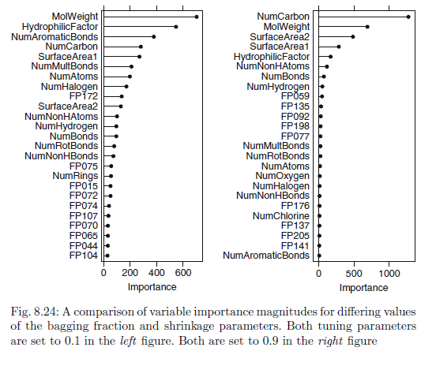

```{r global-options, include=FALSE}
knitr::opts_chunk$set(echo=TRUE, warning=FALSE,
                      message=FALSE,
                      collapse = FALSE,
                      comment = "#>" )
```

# Libraries

Loading in the libraries referenced in Sect. 6.5.


```{r}
library(webshot)
install_phantomjs(force = TRUE)
```


```{r}
library(elasticnet)
library(caret)
library(MASS)
library(lars)
library(stats)
library(pls)
library(tidyverse)
library(dplyr)
library(RANN)
library(GGally)
library(naniar)
library(party)
library(Cubist)
library(gbm)
library(randomForest)
library(tibble)
```


# Week 4 

## KJ 6.3

*A chemical manufacturing process for a pharmaceutical product was discussed in Sec. 1.4. In this problem, the objective is to understand the relationship between biological measurements of the raw materials (predictors), measurements of the manufacturing process (predictors), and the response of product yield. Biological predictors cannot be changed but can be used to assess the quality of the raw material before processing. On the other hand, manufacturing process predictors can be changed in the manufacturing process. Improving product yield by 1% will boost revenue by approximately one hundred thousand dollars per batch ($100,000/batch):*

### (a) 

*Start R and use these commands to load the data:*

*The matrix `processPredictors` contains the 57 predictors (12 describing the input of biological material and 45 describing the process predictors) for the 176 manufacturing runs. `yield` contains the percent yield for each run.*

```{r}
library(AppliedPredictiveModeling)
data(ChemicalManufacturingProcess)
df_raw <- ChemicalManufacturingProcess
```

### b. 

*A small percentage of cells in the predictor set contain missing values. Use the imputation function to fill in these missing values (e.g., see Sec. 3.8).*

```{r}
summary(df_raw)
paste0("Missing Values: ",sum(is.na(ChemicalManufacturingProcess)))
```

```{r fig.height=10}
gg_miss_var(df_raw)
```

```{r}
preProcess_NAdata_model <- preProcess(df_raw, method ="medianImpute")
df <- predict(preProcess_NAdata_model, newdata = df_raw)
```

```{r}
paste0(sum(is.na(df))," values missing after imputation")
```

### c.

*Split the data into a training and test set, pre-process the data, and tune a model of your choice from this chapter. What is the optimal value of the performance metric?*  

**Code References: https://topepo.github.io/caret/pre-processing.html#the-preprocess-function** 

#### Splitting data in to training and test set

```{r}
# Create the training and test datasets
set.seed(100)

# Step 1: Get row numbers for the training data
trainRowNumbers <- createDataPartition(df$Yield, p=0.8, list=FALSE)

# Step 2: Create the training  dataset
trainData <- df[trainRowNumbers,]

# Step 3: Create the test dataset
testData <- df[-trainRowNumbers,]
```

#### Data preprocess

```{r}
preProcValues <- preProcess(trainData, method = c("center", "scale"))

trainTransformed <- predict(preProcValues, trainData)
testTransformed <- predict(preProcValues, testData)

trainTransformed

xTrain <- trainTransformed %>% dplyr::select(-Yield)

yTrain <- trainTransformed %>% dplyr::select(Yield)

xTest  <- testTransformed  %>% dplyr::select(-Yield)

yTest  <- testTransformed %>% dplyr::select(Yield)

```

#### Tune model

```{r warning=FALSE}
lm_model <- train(xTrain, yTrain$Yield, method="lm", trControl=trainControl(method="repeatedcv",repeats=5) )
lm_model
```

```{r}
summary(lm_model)

plot(lm_model$finalModel)
```

### d. 

**Resampling examples from Sect. 4.9 of the text.**

*Predict the response for the test set. What is the value of the performance metric and how does this compare with the resampled performance metric of the training set?*

Predict using the test data set and get the model's performance values

```{r}
finalLMPred <- predict(lm_model$finalModel, newdata = xTest)
## The function 'postResample' can be used to get the test set
## performance values
postResample(pred = finalLMPred, obs = yTest$Yield)
```

As it can be seen in the table below, the resampled performance metrix of the test set is much better than that of the training data set. The RMSE for the test set is smaller than that of the training one.


Model                   |      RMSE  |  Rsquared |       MAE
------------------------|------------|-----------|----------
Linear Model (Training) |  1.7617940 | 0.4240885 | 0.9535992 
Linear Model (Test)     |  1.2731407 | 0.1443080 | 0.7636275

### e.

*Which predictors are the most important in the model you have trained? Do either the biological or process predictors dominate the list?*

Below is a list of the top 10 most important predictors for the Linear Regression model.

```{r}
plot(caret::varImp(lm_model), top = 10)

caret::varImp(lm_model, scale = FALSE)
```

### f. 

*Explore the relationships between each of the top predictors and the response. How could this information be helpful in improving yield in the future runs of the manufacturing process?*

```{r}
library(gridExtra)

top10lmPred <- trainTransformed %>%
   select(Yield, 
          ManufacturingProcess32,
          ManufacturingProcess33,
          ManufacturingProcess28,
          ManufacturingProcess37,
          ManufacturingProcess13,
          ManufacturingProcess07,
          BiologicalMaterial05,
          ManufacturingProcess04,
          ManufacturingProcess16,
          BiologicalMaterial11)

plt01 <- top10lmPred %>%
  ggplot(aes(x = ManufacturingProcess32, y = Yield)) +
  geom_point() + geom_smooth(method = "lm") + theme_bw()

plt02 <- top10lmPred %>%
  ggplot(aes(x = ManufacturingProcess33, y = Yield)) +
  geom_point()+ geom_smooth(method = "lm") + theme_bw()

plt03 <- top10lmPred %>%
  ggplot(aes(x = ManufacturingProcess28, y = Yield)) +
  geom_point() + geom_smooth(method = "lm") + theme_bw()

plt04 <- top10lmPred %>%
  ggplot(aes(x =  ManufacturingProcess37, y = Yield)) +
  geom_point() + geom_smooth(method = "lm") + theme_bw()

plt05 <- top10lmPred %>%
  ggplot(aes(x = ManufacturingProcess13, y = Yield)) +
  geom_point() + geom_smooth(method = "lm") + theme_bw()

plt06 <- top10lmPred %>%
  ggplot(aes(x = ManufacturingProcess07, y = Yield)) +
  geom_point() + geom_smooth(method = "lm") + theme_bw()

plt07 <- top10lmPred %>%
  ggplot(aes(x = BiologicalMaterial05, y = Yield)) +
  geom_point() + geom_smooth(method = "lm") + theme_bw()

plt08 <- top10lmPred %>%
  ggplot(aes(x = ManufacturingProcess04, y = Yield)) +
  geom_point() + geom_smooth(method = "lm") + theme_bw()

plt09 <- top10lmPred %>%
  ggplot(aes(x = ManufacturingProcess16, y = Yield)) +
  geom_point() + geom_smooth(method = "lm") + theme_bw()

plt10 <- top10lmPred %>%
  ggplot(aes(x = BiologicalMaterial11, y = Yield)) +
  geom_point() + geom_smooth(method = "lm") + theme_bw()

# Biological Predictors
grid.arrange(plt07, plt10, nrow = 1, top = "BIOLOGICAL PREDICTORS")

# Process Predictors
grid.arrange(plt01, plt02, plt03, plt04, plt05, plt06, plt08, plt09,
             nrow = 3, top = "PROCESS PREDICTORS")

```

<br>
<br>

We use scatter plots between the top 10 predictors of the model and the response variable.

The conclusion is:

* The 2 biological predictors `BiologicalMaterial05` and `BiologicalMaterial11` appear to have a low positive correlation to the response.

* The top 2 predictors appears to be `ManufacturingProcess32` and `ManufacturingProcess33`. Which, appear to have a positive correlation with the response.

* The predictors `ManufacturingProcess04` and `ManufacturingProcess13` seem to have a negative correlation with the response.

* The predictor `ManufacturingProcess37` seems to have a low negative correlation with the response.

* The remaining predictors `ManufacturingProcess07`, `ManufacturingProcess16` and `ManufacturingProcess28` seem to have no correlation to the response.

\newpage

# Week 5

## KJ 7.2

`Friedman (1991)` introduced several benchmark data sets create by simulation. 

One of these simulations used the following nonlinear equation to create data:

$y = 10 sin(\pi x_1 x_) + 20(x_3 − 0.5)^2 + 10x_4 + 5x_5 + N(0, \sigma^2)$

where the x values are random variables uniformly distributed between [0, 1] (there are also 5 other non-informative variables also created in the simulation).

The package `mlbench` contains a function called `mlbench.friedman1` that simulates these data:

```{r}
library(caret)
library(mlbench)

set.seed(200)
trainingData <- mlbench.friedman1(200, sd = 1)
## We convert the 'x' data from a matrix to a data frame
## One reason is that this will give the columns names.
trainingData$x <- data.frame(trainingData$x)
## Look at the data using
caret::featurePlot(trainingData$x, trainingData$y)
## or other methods.

## This creates a list with a vector 'y' and a matrix
## of predictors 'x'. Also simulate a large test set to
## estimate the true error rate with good precision:
testData <- mlbench.friedman1(5000, sd = 1)
testData$x <- data.frame(testData$x)


```
  
Tune several models on these data. For example:

```{r}

library(caret)
knnModel <- train(x = trainingData$x,
                  y = trainingData$y,
                  method = "knn",
                  preProc = c("center", "scale"),
                  tuneLength = 10)

knnModel

```


```{r}
knnPred <- predict(knnModel, newdata = testData$x)
## The function 'postResample' can be used to get the test set
## perforamnce values
postResample(pred = knnPred, obs = testData$y)
```

**Which models appear to give the best performance? Does MARS select the informative predictors (those named X1–X5)?**

<br>

#### Using a Neural Network model

First, we remove predictors to ensure that the maximum absolute pairwise correlation between the predictors is less than 0.75.

```{r}

tooHigh <- findCorrelation(cor(trainingData$x), cutoff = .75)

tooHigh

```
Since the correlation vector is empty, there are no predictors to remove. We can now fit a neural network model using the existing training set.

```{r}

# Resource: Chapter 7.5 of textbook "Applied Predictive Modeling" by KJ

## Create a specific candidate set of models to evaluate:
nnetGrid <- expand.grid(.decay = c(0, 0.01, .1),
                        .size = c(1:10),
                        .bag = FALSE)

# We can use caret to perform a grid search using 10-fold cross-validation.
# The train function generates a resampling estimate of performance. Because
# the training set size is not small, 10-fold cross-validation should produce
# reasonable estimates of model performance. The function trainControl specifies
# the type of resampling:
ctrl <- trainControl(method = "cv", number = 10)

nnetTune <- train(trainingData$x, trainingData$y,
                  method = "avNNet",
                  tuneGrid = nnetGrid,
                  trControl = ctrl,
                  ## Automatically standardize data prior to modeling
                  ## and prediction
                  preProc = c("center", "scale"),
                  linout = TRUE,
                  trace = FALSE,
                  MaxNWts = 10 * (ncol(trainingData$x) + 1) + 10 + 1,
                  maxit = 500)

nnetTune
```

Predict using the test data set and get the model's performance values

```{r}
nnetPred <- predict(nnetTune, newdata = testData$x)
## The function 'postResample' can be used to get the test set
## performance values
postResample(pred = nnetPred, obs = testData$y)
```

<br>

#### Using a Multivariate Adaptive Regression Splines (MARS) model

```{r}

# Resource: Chapter 7.5 of textbook "Applied Predictive Modeling" by KJ
# Resource: http://uc-r.github.io/mars

library(earth)
library(dplyr)

## Create a specific candidate set of models to evaluate:
marsGrid <- expand.grid(degree = 1:3,
                        nprune = seq(2, 100, length.out = 10) %>% floor()
  )

# We can use caret to perform a grid search using 10-fold cross-validation.
# The train function generates a resampling estimate of performance. Because
# the training set size is not small, 10-fold cross-validation should produce
# reasonable estimates of model performance. The function trainControl specifies
# the type of resampling:
ctrl <- trainControl(method = "cv", number = 10)


# cross validated model
tuned_mars <- train(
  x = trainingData$x,
  y = trainingData$y,
  method = "earth",
  metric = "RMSE",
  trControl = ctrl,
  tuneGrid = marsGrid
)

tuned_mars

```

Plot the MARS model results

```{r}
ggplot(tuned_mars)
```

Show the best tuned MARS model

```{r}
# best chosen MARS model
tuned_mars$bestTune
```

Predict using the test data set and get the model's performance values

```{r}
marsPred <- predict(tuned_mars, newdata = testData$x)
## The function 'postResample' can be used to get the test set
## performance values
postResample(pred = marsPred, obs = testData$y)
```

<br>

#### Using a Support Vector Machines (SVM) model

```{r}

# Resource: Chapter 7.5 of textbook "Applied Predictive Modeling" by KJ

library(kernlab)


# We can use caret to perform a grid search using 10-fold cross-validation.
# The train function generates a resampling estimate of performance. Because
# the training set size is not small, 10-fold cross-validation should produce
# reasonable estimates of model performance. The function trainControl specifies
# the type of resampling:
ctrl <- trainControl(method = "cv", number = 10)


svmRTuned <- train(trainingData$x, trainingData$y,
                   method = "svmRadial",
                   preProc = c("center", "scale"),
                   tuneLength = 14,
                   trControl = ctrl)

svmRTuned

```


Predict using the test data set and get the model's performance values

```{r}
svmPred <- predict(svmRTuned, newdata = testData$x)
## The function 'postResample' can be used to get the test set
## performance values
postResample(pred = svmPred, obs = testData$y)
```


**Which models appear to give the best performance? Does MARS select the informative predictors (those named X1–X5)?**

Comparing all used models we can see that the **MARS** model yields the best performance in terms of the lowest **RMSE = 1.2803060**.


Model                   |      RMSE  |  Rsquared |       MAE
------------------------|------------|-----------|----------
KNN                     |  3.2040595 | 0.6819919 | 2.5683461 
Neural Network (avNNet) |  2.1930855 | 0.8113903 | 1.6402075
MARS                    |  **1.2803060** | 0.9335241 | 1.0168673
SVM                     |  2.0793977 | 0.8249453 | 1.5796370 


\newpage


## KJ 7.5 (Nonlinear Regression Models)

**Exercise 6.3 describes data for a chemical manufacturing process. Use the same data imputation, data splitting, and pre-processing steps as before and train several nonlinear regression models.**


Load libraries used for Exercise 6.3

```{r}
library(RANN)
library(dplyr)
library(naniar)
library(caret)
```

#### Load the data

```{r}
library(AppliedPredictiveModeling)
data(ChemicalManufacturingProcess)
df_raw <- ChemicalManufacturingProcess
```

#### Perform imputation of missing values

```{r}
# check variables for missing values
# gg_miss_var(df_raw)
```

```{r}
preProcess_impute <- preProcess(df_raw, method ="knnImpute")
df <- predict(preProcess_impute, newdata = df_raw)
```

```{r}
# check variables for missing values
# gg_miss_var(df)
```

#### Remove near zero variance predictors

Predictors that have one unique value (i.e. are zero variance predictors) or predictors that are have both of the following characteristics: they have very few unique values relative to the number of samples and the ratio of the frequency of the most common value to the frequency of the second most common value is large. 

```{r}

df <- df %>% select(!caret::nearZeroVar(.))

```


#### Splitting data in to training and test set

```{r}
# Create the training and test datasets
set.seed(100)
# Step 1: Get row numbers for the training data
trainRowNumbers <- createDataPartition(df$Yield, p=0.8, list=FALSE)
# Step 2: Create the training  dataset
trainData <- df[trainRowNumbers,]
# Step 3: Create the test dataset
testData <- df[-trainRowNumbers,]
```

#### Data preprocess applying centering and scaling

```{r}
preProcValues    <- preProcess(trainData, method = c("center", "scale"))
trainTransformed <- predict(preProcValues, trainData)
testTransformed  <- predict(preProcValues, testData)

xTrain <- trainTransformed %>% select(-Yield)
yTrain <- trainTransformed %>% select(Yield)

xTest  <- testTransformed %>% select(-Yield)
yTest  <- testTransformed %>% select(Yield)
```

<br>

#### Fit a KNN model


```{r knn-chem}
knnChemModel <- train(x = xTrain,
                  y = yTrain$Yield,
                  method = "knn",
                  preProc = c("center", "scale"),
                  tuneLength = 10)

knnChemModel

```


```{r}
knnChemPred <- predict(knnChemModel, newdata = xTest)
## The function 'postResample' can be used to get the test set
## perforamnce values
postResample(pred = knnChemPred, obs = yTest$Yield)
```


<br>

#### Fit a Neural Network model

First, we remove predictors to ensure that the maximum absolute pairwise correlation between the predictors is less than 0.75.

```{r}

tooHigh <- findCorrelation(cor(xTrain), cutoff = .75)

tooHigh

```
Since the correlation vector is not empty, there are predictors to be removed. After removal, generate a new training and test sets of predictors. 

```{r}
trainXnnet <- xTrain[, -tooHigh]
testXnnet  <- xTest[, -tooHigh]
```


We can now fit a neural network model using the existing training set.

```{r nnet-chem}

# Resource: Chapter 7.5 of textbook "Applied Predictive Modeling" by KJ

## Create a specific candidate set of models to evaluate:
nnetGrid <- expand.grid(.decay = c(0, 0.01, .1),
                        .size = c(1:10),
                        .bag = FALSE)

# We can use caret to perform a grid search using 10-fold cross-validation.
# The train function generates a resampling estimate of performance. Because
# the training set size is not small, 10-fold cross-validation should produce
# reasonable estimates of model performance. The function trainControl specifies
# the type of resampling:
ctrl <- trainControl(method = "cv", number = 10)

nnetChemTune <- train(xTrain, yTrain$Yield,
                  method = "avNNet",
                  tuneGrid = nnetGrid,
                  trControl = ctrl,
                  ## Automatically standardize data prior to modeling
                  ## and prediction
                  preProc = c("center", "scale"),
                  linout = TRUE,
                  trace = FALSE,
                  MaxNWts = 10 * (ncol(trainXnnet) + 1) + 10 + 1,
                  maxit = 500)

nnetChemTune
```

Predict using the test data set and get the model's performance values

```{r}
nnetChemPred <- predict(nnetChemTune, newdata = xTest)
## The function 'postResample' can be used to get the test set
## performance values
postResample(pred = nnetChemPred, obs = yTest$Yield)
```
<br>

#### Fit a MARS model


```{r mars-chem}

# Resource: Chapter 7.5 of textbook "Applied Predictive Modeling" by KJ
# Resource: http://uc-r.github.io/mars

library(earth)
library(dplyr)

## Create a specific candidate set of models to evaluate:
marsGrid <- expand.grid(degree = 1:3,
                        nprune = seq(2, 100, length.out = 10) %>% floor()
  )

# We can use caret to perform a grid search using 10-fold cross-validation.
# The train function generates a resampling estimate of performance. Because
# the training set size is not small, 10-fold cross-validation should produce
# reasonable estimates of model performance. The function trainControl specifies
# the type of resampling:
ctrl <- trainControl(method = "cv", number = 10)


# cross validated model
tuned_ChemMARS <- train(
  x = xTrain,
  y = yTrain$Yield,
  method = "earth",
  metric = "RMSE",
  trControl = ctrl,
  tuneGrid = marsGrid
)

tuned_ChemMARS

```

Predict using the test data set and get the model's performance values

```{r}
marsChemPred <- predict(tuned_ChemMARS, newdata = xTest)
## The function 'postResample' can be used to get the test set
## performance values
postResample(pred = marsChemPred, obs = yTest$Yield)
```

<br>

#### Fit an SVM model


```{r svm-chem}

# Resource: Chapter 7.5 of textbook "Applied Predictive Modeling" by KJ

library(kernlab)


# We can use caret to perform a grid search using 10-fold cross-validation.
# The train function generates a resampling estimate of performance. Because
# the training set size is not small, 10-fold cross-validation should produce
# reasonable estimates of model performance. The function trainControl specifies
# the type of resampling:
ctrl <- trainControl(method = "cv", number = 10)


svmChemRTuned <- train(xTrain, yTrain$Yield,
                   method = "svmRadial",
                   preProc = c("center", "scale"),
                   tuneLength = 14,
                   trControl = ctrl)

svmChemRTuned

```


Predict using the test data set and get the model's performance values

```{r}
svmChemPred <- predict(svmChemRTuned, newdata = xTest)
## The function 'postResample' can be used to get the test set
## performance values
postResample(pred = svmChemPred, obs = yTest$Yield)
```


<br>

### a. Which nonlinear regression model gives the optimal resampling and test set performance?


Comparing all used models we can see that the **Neural Network (avNNet)** model yields the best performance in terms of the lowest RMSE = 0.5594510.


Model                   |      RMSE  |  Rsquared |       MAE
------------------------|------------|-----------|----------
KNN                     |  0.6501442 | 0.4623051 | 0.5205731 
Neural Network (avNNet) |  **0.5594510** | 0.6676931 | 0.4589402
MARS                    |  0.5754156 | 0.6002260 | 0.4630585
SVM                     |  0.5682649 | 0.5880968 | 0.4506714 


<br>


### b. Which predictors are most important in the optimal nonlinear regression model? Do either the biological or process variables dominate the list? How do the top ten important predictors compare to the top ten predictors from the optimal linear model?


* The **Neural Network (avNNet)** model yields the best performance in terms of the lowest RMSE = 0.5594510. For such model, below are the predictors in order of importance. A plot of them is also provided.

* The comparison of the top ten most important predictor between the NNET model and the Linear Model shows that the most important predictor is the `"ManufacturingProcess32"`. The rest of the predictors are ranked differently between the 2 models. The NNET model captured only one biological predictor `"BiologicalMaterial11"` in the top 10 list. While the Linear Model ranked 4 biological predictors in the top 10.

Importance|Linear Model Top Predictors| Overall|NNET Model Predictors| Overall
-------|-----------------------|-----------|-----------------------|-----------
      `1|ManufacturingProcess32 |4.0148629 | ManufacturingProcess32 |100.00000`
      2|ManufacturingProcess33 |2.5534232 | ManufacturingProcess13 |97.83640
      3|ManufacturingProcess28 |2.2725763 | BiologicalMaterial06   |82.21744
      4|ManufacturingProcess37 |2.1891986 | ManufacturingProcess17 |77.26777
      5|ManufacturingProcess13 |2.0341703 | BiologicalMaterial03   |76.21094
      6|ManufacturingProcess07 |1.7731421 | ManufacturingProcess36 |70.96498
      7|BiologicalMaterial05   |1.6380685 | BiologicalMaterial02   |68.78876
      8|ManufacturingProcess04 |1.6338725 | ManufacturingProcess09 |67.86384
      9|ManufacturingProcess16 |1.5879600 | BiologicalMaterial12   |63.36203
     10|BiologicalMaterial11   |1.5688048 | ManufacturingProcess06 |55.15443


```{r}
plot(caret::varImp(nnetChemTune), top = 10)

caret::varImp(nnetChemTune)

```


<br>


### c. Explore the relationships between the top predictors and the response for the predictors that are unique to the optimal nonlinear regression model. Do these plots reveal intuition about the biological or process predictors and their relationship with yield?


```{r}
library(gridExtra)

top9nnetPred <- trainTransformed %>%
   select(Yield, 
          ManufacturingProcess13,
          BiologicalMaterial06,
          ManufacturingProcess17,
          BiologicalMaterial03,
          ManufacturingProcess36,
          BiologicalMaterial02,
          ManufacturingProcess09,
          BiologicalMaterial12,
          ManufacturingProcess06)

plt01 <- top9nnetPred %>%
  ggplot(aes(x = ManufacturingProcess13, y = Yield)) +
  geom_point() + geom_smooth(method = "lm") + theme_bw()

plt02 <- top9nnetPred %>%
  ggplot(aes(x = BiologicalMaterial06, y = Yield)) +
  geom_point()+ geom_smooth(method = "lm") + theme_bw()

plt03 <- top9nnetPred %>%
  ggplot(aes(x = ManufacturingProcess17, y = Yield)) +
  geom_point() + geom_smooth(method = "lm") + theme_bw()

plt04 <- top9nnetPred %>%
  ggplot(aes(x = BiologicalMaterial03, y = Yield)) +
  geom_point() + geom_smooth(method = "lm") + theme_bw()

plt05 <- top9nnetPred %>%
  ggplot(aes(x = ManufacturingProcess36, y = Yield)) +
  geom_point() + theme_bw()

plt06 <- top9nnetPred %>%
  ggplot(aes(x = BiologicalMaterial02, y = Yield)) +
  geom_point() + geom_smooth(method = "lm") + theme_bw()

plt07 <- top9nnetPred %>%
  ggplot(aes(x = ManufacturingProcess09, y = Yield)) +
  geom_point() + geom_smooth(method = "lm") + theme_bw()

plt08 <- top9nnetPred %>%
  ggplot(aes(x = BiologicalMaterial12, y = Yield)) +
  geom_point() + geom_smooth(method = "lm") + theme_bw()

plt09 <- top9nnetPred %>%
  ggplot(aes(x = ManufacturingProcess06, y = Yield)) +
  geom_point() + geom_smooth(method = "lm") + theme_bw()

# Biological Predictors
grid.arrange(plt02, plt04, plt06, plt08, nrow = 2, top = "BIOLOGICAL PREDICTORS")

# Process Predictors
grid.arrange(plt01, plt03, plt05, plt07, plt09,
             nrow = 2, top = "PROCESS PREDICTORS")

```

<br>
<br>

We use scatter plots between the top predictors and the response for the TOP 9 predictors that are unique to the optimal nonlinear regression model.

The conclusion is:

* All four Biological predictors (`BiologicalMaterial02`, `BiologicalMaterial36`, `BiologicalMaterial06`, `BiologicalMaterial12`) appear to have low positive correlation to the response variable.

* The `ManufacturingProcess13` and `ManufacturingProcess17` appear to have low negative correlation to the response within a limited interval in each case. Also, there are a few outliers outside of the intervals.

* Predictor `ManufacturingProcess17` appears to have no correlation to the response. The points seem to form parallel vertical lines every 2.5 units. I am not sure why this predictor would come up in the top 10 predictors for the optimal non-linear regression model.

* Process predictors `ManufacturingProcess09` and `ManufacturingProcess06` seem to have a low positive correlation within a limited interval in each case.

\newpage

## KJ 8.1 (Regression Trees and Rule-Based Models)

**Recreate the simulated data from Exercise 7.2:**

```{r}
library(mlbench)
set.seed(200)
simulated <- mlbench.friedman1(200, sd = 1)
simulated <- cbind(simulated$x, simulated$y)
simulated <- as.data.frame(simulated)
colnames(simulated)[ncol(simulated)] <- "y"
head(simulated)
```

### a. Fit a random forest model to all of the predictors, then estimate the variable importance scores:

```{r}
set.seed(600)


model1 <- randomForest(y ~., data = simulated, importance = TRUE, ntree = 1000) # model

rfImp1 <- varImp(model1, scale = FALSE) # Random Forest Importance Scores

rfImp1 <- tibble::rownames_to_column(rfImp1, "Predictors")
rfImp1
rfImp1[order(-rfImp1$Overall),]
```

Did the random forest model significantly use the uninformative predictors (V6-V10)?

Looking at the table above, the importance scores for the predictors indicate the model relies heavily upon V1, V4, V2, and V5 respectively, unlike predictors V3 and V6-V10 not having much importance to the model

```{r}
# Visualization for original models' scores
rfImp1 %>%
  mutate(name = fct_reorder(Predictors, Overall)) %>%
  ggplot(aes(x = name, y = Overall)) +
    geom_segment(aes(x=Predictors, xend=Predictors, y=min(Overall), yend= Overall), color = "grey") +
    geom_point(color = "orange", size = 4) +
    xlab("Model 1 Predictor Importance") +
    theme_light() + theme_classic() +
    coord_flip()
```

### b. Now add an additional predictor that is highly correlated with one of the informative predictors. For example:

<<<<<<< Updated upstream
### b. Now add an additional predictor that is highly correlated with one of the informative predictors. For example:
=======
```{r}
# From book

simulated$duplicate1 <- simulated$V1 + rnorm(200) * .1
cor(simulated$duplicate1, simulated$V1)
```

Fit another random forest model to these data. Did the importance score for $V1$ change? What happens when you add another predictor that is also highly correlated with $V1$?

Looking at the dataframe below, the importance of V1 decreased when a new V1-correlated predictor was introduced. V4, V2, V1, the New Variable, and V5  respectively are all the most important predictors from this random forest model. Compared to the last model, these top predictors bear a similar importance and order.

```{r}
model2 <- randomForest(y~., data = simulated,  importance = T, ntree = 1000)
rfImp2 <- varImp(model2, scale = F)

Prednames <- c("V1", "V2", "V3", "V4", "V5", "V6", "V7", "V8", "V9", "V10", "NEW") 
rfImp2$Variables <- factor(rownames(rfImp2), levels = Prednames)

rfImp2[order(-rfImp2$Overall),]
```

### c. Use the `cforest` function in the `party` package to fit a random forest model using conditional inference trees. The `party` package function `varimp` can calculate predictor importance. The `conditional` argument of that function toggles between the traditional importance measure and the modified version described in `Strobl et al. (2007)`. Do these importances show the same pattern as the traditional random forest model?

Looking at these importances, they resemble a close pattern to the traditional random forest model with V1, V2, V4, and V5 all having the most importance out of all predictors in varying orders.

[cforest](https://www.rdocumentation.org/packages/partykit/versions/1.2-16/topics/cforest)

[Conditional Random Forests](https://stephsus.github.io/shih_randomforests.pdf)

```{r}
set.seed(555)
cforest1 <- cforest(y~., data = simulated[,1:11], controls = cforest_control(ntree = 1000))
```

```{r}
set.seed(444)
cforest2 <- cforest(y~., data = simulated[,1:11], controls = cforest_control(ntree = 1000))
```

```{r}
# Variable Importances 

cfImp1 <- varimp(cforest1)
cfImp2 <- varimp(cforest2)

cfImp1_cond <- varimp(cforest1, conditional = T)
cfImp2_cond <- varimp(cforest2, conditional = T)
```

```{r}
# Comparing performances with conditional and non conditional random forests
cfImp1 <- data.frame(Original = cfImp1, Variable = factor(names(cfImp1), levels = Prednames))

cfImp2 <- data.frame(Extra = cfImp2, Variable = factor(names(cfImp2), levels = Prednames))

cfImp1_cond <- data.frame(CondInf = cfImp1_cond, Variable = factor(names(cfImp1_cond), levels = Prednames))

cfImp2_cond <- data.frame(Extra_CondInf = cfImp2_cond, Variable = factor(names(cfImp2_cond), levels = Prednames))

cfImp1[order(-cfImp1$Original),]
cfImp2[order(-cfImp2$Extra),]
cfImp1_cond[order(-cfImp1_cond$CondInf),]
cfImp2_cond[order(-cfImp2_cond$Extra_CondInf),]
```


### d. Repeat this process with different tree models, such as boosted trees and Cubist. Does the same pattern occur?

Per the wording of the problem, it does not seem boosted trees is a required method of random forest for this question. therefore, Bagging and Cubist methods were used. 

Using bagging and cubist methods, the same pattern does generally occur. In the case of bagging, V5 has a higher rank in the importance of its weight, and V3 has less importance as a predictor. In the cubist method, this resembles closer to the original pattern.

```{r}
# Boosted Trees: original
# Specifying t-distribution
# Having difficulty, might omit

# gbmModel <- gbm(y~., data = simulated, distribution = "tdist")
# 
# booImp1 <- varImp(gbmModel)

```

```{r}
# Trying bagging method
set.seed(777)
bagfit1 <- ipred::bagging(y~., data = simulated[,1:11], nbag = 60)

bag1Imp <- varImp(bagfit1)

bag1Imp$Variable <- factor(rownames(bag1Imp), levels = Prednames)

bag1Imp[order(-bag1Imp$Overall),]
```

```{r}
set.seed(888)
bagfit2 <- ipred::bagging(y~., data = simulated[,1:11], nag = 60)

bag2Imp <- varImp(bagfit2)


bag2Imp$Variable <- factor(rownames(bag2Imp), levels = Prednames)

bag2Imp[order(-bag2Imp$Overall),]
```


```{r}
# Cubist: original
set.seed(222)

cbfit1 <- cubist(x = simulated[, 1:10], y = simulated$y, committees = 100)

cbImp1 <- varImp(cbfit1)
names(cbImp1) <- "Original"
cbImp1$Variable <- factor(rownames(cbImp1), levels = Prednames)

cbImp1[order(-cbImp1$Variable),]
```

```{r}
# Cubist: extra
set.seed(111)

cbfit2 <- cubist(x = simulated[ , names(simulated) !="y"], y = simulated$y, committees = 100)

cbImp2 <- varImp(cbfit2)
names(cbImp1) <- "Extra"
cbImp2$Variable <- factor(rownames(cbImp2), levels = Prednames)

cbImp2[order(-cbImp2$Variable),]
```

>>>>>>> Stashed changes
\newpage

## KJ 8.2 (Regression Trees and Rule-Based Models)
 
**Use a simulation to show tree bias with different granularities.**

Looking at the plots below, we can see the relationship between the predictor and response. The predictor, X1, is a binomial random variable (1,2) of 450 observations which are used to create homogeneous responses according to the predictor. X2 on the other hand, which is comprised of 450 observations as well, is much more random, unrelated to the response, and therefore considered "granular". *Would like to add more commentary to this idea of granularity and what the author means*

```{r, warning = FALSE}
set.seed(222)

x1 <- rep(1:2, each = 450)

y <- x1 + rnorm(450, mean = 0, sd = 1)
```

```{r}
set.seed(111)

x2 <- rnorm(450, mean = 0, sd = 2)
```

```{r}
simulated_data <- data.frame(Y = y, X1 = x1, X2 = x2)
```

```{r}
plot(simulated_data$Y ~ simulated_data$X1 + simulated_data$X2)
```




\newpage

## KJ 8.3 (Regression Trees and Rule-Based Models)

**In stochastic gradient boosting the bagging fraction and learning rate will govern the construction of the trees as they are guided by the gradient. Although the optimal values of these parameters should be obtained through the tuning process, it is helpful to understand how the magnitudes of these parameters affect magnitudes of variable importance. Figure 8.24 provides the variable importance plots for boosting using two extreme values for the bagging fraction (0.1 and 0.9) and the learning rate (0.1 and 0.9) for the solubility data. The left-hand plot has both parameters set to 0.1, and the right-hand plot has both set to 0.9:**

### a. 

**Why does the model on the right focus its importance on just the first few of predictors, whereas the model on the left spreads importance across more predictors?**

The learning rate referenced in the questions prompt is also called "regularization" or "shrinkage" and is a means to limit the "greedy" nature of boosting. From page 206 of our KJ text, "Friedman recognized that his gradient boosting machine could be susceptible to over-fitting, since the learner employed...is tasked with optimally fitting the gradient.

The lower the learning rate the less shrinkage there is and the lower the change in predicted model from previous boosting iterations. As the learning parameter is increased the model will "learn" quicker and perhaps be more prone to overfit and overvalue fewer variables of importance. 

### b. 

**Which model do you think would be more predictive of other samples?**

Because gradiant boosting may overfit more readily with a higher learning parameter, the model on the *left* would likely be more predictive of other samples.


### c. How would increasing interaction depth affect the slope of predictor importance for either model in Fig. 8.24?

As more variables are incorporated as the interaction depth increases, the slope of the importance of variables will flatten out. 


\newpage

## KJ 8.7 (Regression Trees and Rule-Based Models)

**Refer to Exercises 6.3 and 7.5 which describe a chemical manufacturing process. Use the same data imputation, data splitting, and pre-processing steps as before and train several tree-based models**

### a. 

**Which tree-based regression model gives the optimal resampling and test set performance?**

#### Single Tree
```{r}
library(rpart)
library(partykit)

rpartTree <- rpart(Yield ~., data = trainData)
```

#### Random Forest
```{r}
rfModel <- randomForest(Yield~., data = trainData,
                        importance = TRUE,
                        ntree = 1000)
```

#### Boosted Trees
```{r}
gbmModel <- train(Yield ~., data = trainData, method = "gbm",
                verbose = FALSE)
```

#### Cubist
```{r}
cubistTuned <- train(Yield~., data = trainData, method = "cubist")
```

```{r}
postResample(predict(rpartTree, testData), testData$Yield)
postResample(predict(rfModel, testData), testData$Yield)
postResample(predict(gbmModel, testData), testData$Yield)
postResample(predict(cubistTuned, testData), testData$Yield)
```
Model                   |      RMSE  |  Rsquared |       MAE
------------------------|------------|-----------|----------
Single Tree             |       0.70 |      0.41 |      0.56
Random Forest           |       0.53 |      0.68 |      0.45
Boosted Trees           |       0.52 |      0.67 |      0.43  
Cubist                  |       0.50 |      0.72 |      0.37

Based on the results in the above table, the cubist model performs best with the test data set.

### b. 

**Which predictors are most important in the optimal tree-based regression model? Do either the biological or process variables dominate the list? How do the top 10 important predictors compare to the top 10 predictors from the optimal linear and nonlinear models?**

Compared to the linear and nonlinear counterparts, the most important factors are a balance between biological and manufacturing variables. All three chose `ManufacturingProcess32` as the most important variable.

#### Tree-based Models
```{r}
plot(caret::varImp(cubistTuned), top = 10)
caret::varImp(cubistTuned)
```

#### Linear Models
```{r}
plot(caret::varImp(lm_model), top = 10)
caret::varImp(lm_model, scale = FALSE)
```

#### Nonlinear Models

```{r}
plot(caret::varImp(nnetChemTune), top = 10)
caret::varImp(nnetChemTune)
```

### c. 

**Plot the optimal single tree with the distribution of yield in the terminal nodes. Does this view of the data provide additional knowledge about the biological or process predictors and their relationship with yield?**

This view does provide some additional information related to the biological and process predictors. Manufacturing predictors are more prevalent with other manufacturing indicators and the same appears to be true for biological ones. The tree has a balance between bio and manufacturing variables. It also parses one of the most important features of the three approaches and how other factors weigh into `ManufacturingProcess32`.

```{r}
library(rpart.plot)
rpart.plot(rpartTree)
```


\newpage

# Week 6

## HW BATCH #2 - Market Basket Analysis / Recommender Systems (a simple problem)

**I am assigning one simple problem on market basket analysis / recommender systems.**

**Imagine 10000 receipts sitting on your table. Each receipt represents a transcation with items that were purchased. The receipt is a representation of stuff that went into a customer's basket - and therefore 'Market Basket Analysis'.**

**That is exactly what the Groceries Data Set contains: a collection of receipts with each line representing 1 receipt and the items purchased. Each line is called a** $$transaction$$ **and each column in a row represents an** $item.$

**Here is the dataset =**[GroceryDataSet.csv](https://bbhosted.cuny.edu/bbcswebdav/pid-8461316-dt-announcement-rid-389564218_1/xid-389564218_1)**(comma separated file)**

**You assignment is to use R to mine the data for association rules. You should report support confidence and lift and your top 10 rules by lift. Turn in as you would the other problems from HA and KJ. You should packaged this with your HW#2 set.**

**NOTE: Bonus - Use a Python Library in addition to R and get a Bonus.**

___

<center>


</center>

### 1. Introduction

The database contains customer transactions, 1000 receipts, that will be analyzed to predict customer's shopping trends and potentially provide bundle product recommendations with a more attractive price offer than buying the products individually.

For example, information can be extracted on consumer behavior like *If someone buys coffee and creamer, then is likely to buy cookies with high probability".


### 2. Required Libraries (Python and RMarkdown)

Load some libraries and import data.
```{r message=FALSE, warning=FALSE}
#Load required R language libraries
require(tidyverse)    # data manipulation
require(arules)       # mining association rules and frequent itemsets
require(arulesViz)    # visualization techniques for association rules
require(RColorBrewer) # graphics color
library(reticulate)   # R interface to Python
```


```{r eval=FALSE}
#Installing Python Packages 
py_install("pandas")
py_install("mlxtend")
py_install("seaborn")
```


### 3. Load Dataset (Python) 

Loading the data set with python function, `pandas:read_csv method`. The data represents transaction data from a point of sales system on customer data.

```{python}
import pandas as pd
groc = pd.read_csv("GroceryDataSet.csv", header=None)
# Load data from a CSV file and hide the header
print("\nReading the CSV file (without header)...\n", groc.head(10))
```


With the python function, `pandas:shape method`, view a tuple representing the dimensions of a object:
```{python}
groc.shape
```
... has 9835 observations (rows) recorded for 32 (columns) variables.


View the data frame summary information in R (add `py$` to the variable).
```{r message=FALSE, warning=FALSE}
#Explore the data structure with an R function
skimr::skim_without_charts(py$groc)
```


### 4. Convert to a Transactional Dataset - Market Basket Analysis using R

Convert data frame to a class `transactions` for perform association mining as follows:
```{r}
#Read the data as transactions class
grocery <- read.transactions("GroceryDataSet.csv", sep = ",", rm.duplicates = TRUE)
```


#### 4.1 Transaction object
```{r}
grocery
```


#### 4.2 Summary 
```{r}
summary(grocery)
```


The `summary(grocery)` informs us about the transaction object output:

* There are **9835 transactions (rows) and 169 items (columns).**

* **Density** tells the percentage of non-zero cells in the sparse matrix.

* Summary tell the most frequent items.

* **Element (itemset/transaction) length distribution:** Indicates how many transactions are there for 1-itemset, for 2-itemset and so on. 

<br>

### 5. Data Analysis with Visualizations


Plots showing transactions object most frequent, absolute and relative, items in the data set.

Independent transactions expressed as a whole number ...
```{r}
#Checking top 20 items sold in the dataset
itemFrequencyPlot(grocery,topN=20,type="absolute",col=brewer.pal(7,'Greens'),space=(0.5),width=(0.5),xlab="Item Name",ylab="Item Frequency(absolute)",main="Absolute Item Frequency Plot")
```


The amount of times an item/transaction have appeared as compared to others, expressed as a percentage ...
```{r}
#Again checking top 20 items sold in the given dataset with type=relative
itemFrequencyPlot(grocery,topN=20,type="relative",col=brewer.pal(8,'Spectral'),space=(0.5),width=(0.5),xlab="Item Name",ylab="Frequency(relative)",main="Relative Item Frequency Plot")
```


*Observation:* Whole milk is the best selling product, followed by other vegetables. 

<br>

### 6. Apriori Algorithm (R)

**Association Rules**

The associated rules explain the relationship of:

$ \left\{ antecedent \right \} \rightarrow \left\{ consequent \right \}$

where \hspace$A \rightarrow B[Support, Confidence]$


In the analysts, association rules is a data mining measures to compare the relationship between items using these metrics: (1) support, (2) confidence, and (3) lift.

*Support* - refers to the popularity of a single item, based on how frequently customers buy it compared to other products.

*Confidence* - refers to how often customers purchase two products in an item set (the percentage in which B is bought with A). 

*Lift* - refers to the likelihood that a customer will purchase the first and second item together in a set. 


#### 6.1 Training the algorithm

Train the selected algorithm (Apriori)
```{r}
#Training apriori algorithm on dataset
rules <- apriori(data=grocery,parameter=list(support=0.001,confidence=0.9, minlen= 2, maxlen=10, target = "rules"))
```


The `association rules` metrics settings will find frequent itemsets that satisfies `0.1% Support, 90% Confidence, and Maximum of number of items at 10`.

The total number of rules is 129, with a minimum purchase of 2 item and maximum is 10.


```{r}
summary(rules) # This gives set of rules generated here it is 129, number of transactions, support and confidence values that we have given in previous code
```


`Summary (rules)` shows the following:

* **Total number rules:** The set of 129 rules.

* **Rule length distribution (LHS + RHS):** A length of 4 items has the most rules: 57 and length of 6 items have the lowest number of rules:6.

* **Summary of quality measures:** min, max, median, mean and quantile values for support, confidence and lift.

* **Information used for creating rules:** The data, support, and confidence.

<br>

View the top 10 rules:
```{r}
#show the top 10 rules
options(digits = 2)
inspect(rules[1:10])
```


*Convert rules into data frame*
```{r eval=FALSE}
rules2 <- rules
rules3 <- as(rules2, "data.frame")
write.csv(rules3, file = "D:/CUNY SPS/2022 Summer Course/DATA624/rules.csv", sep=",")
```


*Inspect the top 10 rules sorted by lift:*

The recommendation is based on historical preference and ratings to find similarities between users and items.

```{r}
options(digits = 2)
#visualize the results
inspect(sort(rules, by="lift", decreasing=TRUE)[1:10]) 
#`high-confidence' rules
# show the support, lift and confidence for the first 10 rules
```


*Lift Interpretation:* A rule with a lift count (`see rules_lift` above) imply that, the items in LHS and RHS are `n times` more likely to be purchased together compared to the purchases when they are assumed to be unrelated. For example, **{liquor, red/blush wine} paired with {bottled beer}** has a high support and confidence threshold as a bundled transactional sale. 

**Interpretation of Rules sorted by LIFT**
* 90% of the customers who purchased `butter, cream cheese, root vegetables (lhs)` also purchased `yogurt (rhs)` is `7 times` more likely to purchase the itemset as a bundle sale.
* 100% of the customers who purchased `brown bread, pip fruit, whipped/sour cream (lhs)` also purchased `other vegetables (rhs)` is `5 times` more likely to purchase the itemset as a bundle sale.

<br> 


*Inspect the top 10 rules sorted by confidence:*

The `lhs` represents items already taken in a basket, `rhs` represents items frequently taken together along with purchased items. 

```{r}
options(digits = 2)
#visualize the results
inspect(sort(rules, by="confidence", decreasing=TRUE)[1:10]) 
#`high-confidence' rules
# show the support, lift and confidence for the first 10 rules
```


*Confidence Interpretation:* The rules with confidence of 1 (`see rules_conf` above) imply that, whenever the LHS item is purchased, the RHS item was purchased 100% of the time. Popular items that are derive from this analysis are: **{rice, sugar} with {whole milk}** and **{canned fish, hygiene articles} with {whole milk}**.

<br>

#### 6.2 Visualizing Association Rules

**Matrix**

Plot showing the measure of interestingness. The default reordering average measure (typically lift) pushes the rules with the highest lift value to the top-left corner of the plot.
```{r message=FALSE, warning=FALSE}
sel <- subset(rules, lift>6)
plot(sel, method="matrix", measure="lift")
```


**A Grouped Matrix of Association Rules**

Plot showing group matrix-based visualization. Antecedents (columns) in the matrix are grouped using clustering.  The most interesting item in the group (highest support in the group to support in all rules): liquor, red/blush wine.
```{r}
plot(rules, method="grouped", control = list(k = 10))
```


```{r eval=FALSE}
if (!require("BiocManager", quietly = TRUE))
    install.packages("BiocManager")

BiocManager::install("Rgraphviz")
```


**A Graph model**

Visualize the `10 rules` (or itemsets) as a graph with items as labeled vertices, and rules (or itemsets) represented as vertices connected to items using arrows. 

```{r}
# Filter rules with lift greater than 7
subRules<-rules[quality(rules)$lift>7]

top10subRules <- head(subRules, n = 10, by = "lift")
```


```{r}
 #plot(top10subRules, method = "graph",  engine = "htmlwidget")
```


```{r}
#export/save as a Graphviz dot-file
#saveAsGraph(head(subRules, n = 10, by = "lift"), file = "rules.graphml")
```


```{r warning=FALSE, message=TRUE}
plot(rules[1:10], method = 'graph', control = list(col=brewer.pal(6, 'Dark2')))
```


### 7. Apriori Algorithm (Python)

The `Python` apriori algorithm will be used as a comparison to `R` for Association Rule Mining. 

#### 7.1 Required Libraries (Python)

**Install Required Modules:**

```{python}
import numpy as np
#import pandas as pd
import seaborn as sns #table style
import warnings # mask chunk code warnings 
```

```{python}
# importing data mining module
from apyori import apriori
```

```{python}
from mlxtend.preprocessing import TransactionEncoder
```


```{python}
# importing required plots module
import plotly.express as px  #plotly tree map
import matplotlib.pyplot as plt #treemap
from IPython.display import display
```

#### 7.2 Load Data Set

Data was loaded in **Section 3. Load Dataset (Python)**

<br>

#### 7.3 Exploring the Data set

Store all purchased items in a NumPy array for easy identification of NULL values in dataset. 
```{python, warning = FALSE, message= FALSE}
warnings.filterwarnings('ignore')

# Gather All Items of Each Transactions into Numpy Array
transactions = []
for i in range(0, groc.shape[0]):
    for j in range(0, groc.shape[1]):
        transactions.append(groc.values[i,j])

# converting to numpy array
transactions = np.array(transactions)
print(transactions, 10)
```


The data is in NumPy array format. We can now remove all the null values and print out the top 10 frequently occurring items.

```{python}
#  Transform Them a Pandas DataFrame
df = pd.DataFrame(transactions, columns=["items"]) 

# Put 1 to Each Item For Making Countable Table, to be able to perform Group By
df["incident_count"] = 1 

#  Delete NaN Items from Dataset
indexNames = df[df['items'] == "nan" ].index
df.drop(indexNames , inplace=True)

# Delete Nan Items in rows
df_new = df.dropna()

# Making a New Appropriate Pandas DataFrame for Visualizations  
df_table = df_new.groupby("items").sum().sort_values("incident_count", ascending=False).reset_index()

#  Initial Visualizations
display(df_table.head(10))
```


These are the top 10 most purchased items by customers.

*Counting number of missing values*
```{python}
print("\nResulting in a Pandas Series containing the number of missing values in each column...\n", df_new.isna().sum())
```

#### 7.5 Visualization - Top Items

**Treemap to visualize the purchase**

```{python}
# to have a same origin
df_table["10"] = "Top 10 items" 

# creating tree map using plotly
fig = px.treemap(df_table.head(10), path=["items", 'incident_count', '10'], values='incident_count',
                  color=df_table["incident_count"].head(10), hover_data=['items'],
                  color_continuous_scale='Blues',
                )

```

<center>


</center>


#### 7.6 Converting Data Set to a Transaction Object

**Pre-processing dataset**

We will perform the conversion of the transactions into equi-length transactions as shown in the following code:

```{python}
# Data Cleaning step
# replacing empty value with 0.
pygroc = groc
pygroc.fillna(0,inplace=True)

# Data Pre-processing step
# for using aprori , need to convert data in list format..

transaction = []

for i in range(0,len(pygroc)):
    transaction.append([str(pygroc.values[i,j]) for j in range(0,20) if str(pygroc.values[i,j])!='0'])
```

The above code replaces `nan` values with zero's, then initialized the list `transaction` and stored the transactions of length 20 in it. We had to remove the null values again inside transactions when items were fewer than 20.


```{python}
## verifying - by printing the 0th transaction
print("\nVerifying the 1st, Index 0, transaction\n", transaction[0])
```


```{python}
## verifying - by printing the 1st transaction
print("\nVerifying the 2nd, Index 1, transaction\n", transactions[1])
```


#### 7.7 Implement Apriori Algorithm (Python)

Performing the association rules from our data with the `apriori` class constructor.
```{python}
Pyrules = apriori(transaction, min_support=0.001, min_confidence = 0.9, min_length = 2, max_length = 10)
```


The apriori algorithm's associated rules are stored inside the `rules` generator object as shown: 
```{python}
Pyrules
```

```{python}
# all rules need to be converted in a list..
Pyresults = list(Pyrules)
#Pyresults

# convert result in a dataframe for further operation...
dfresults = pd.DataFrame(Pyresults)

dfresults.head()
```


```{python}
# keep support in a separate data frame so we can use later.. 
support = dfresults.support
```

**Converting orderstatistic in a proper format.**

Order statistic has lhs => rhs as well rhs => lhs. Let's choose first one which is 'df_results['ordered_statistics'][i][0]'

```{python}
#all four empty list which will contain lhs, rhs, confidence and lift respectively.
first_values = []
second_values = []
third_values = []
fourth_value = []

# loop number of rows time and append 1 by 1 value in a separate list.. 
# first and second element was frozenset which need to be converted in list..
for i in range(dfresults.shape[0]):
    single_list = dfresults['ordered_statistics'][i][0]
    first_values.append(list(single_list[0]))
    second_values.append(list(single_list[1]))
    third_values.append(single_list[2])
    fourth_value.append(single_list[3])
```


```{python}
# convert all four list into dataframe for further operation..
lhs = pd.DataFrame(first_values)
rhs = pd.DataFrame(second_values)

confidence=pd.DataFrame(third_values,columns=['Confidence'])

lift=pd.DataFrame(fourth_value,columns=['lift'])
```


```{python}
# concat all list together in a single dataframe
df_final = pd.concat([lhs,rhs,support,confidence,lift], axis=1)
df_final
```


```{python}
'''
 we have some of place only 1 item in lhs and some place 3 or more so we need to a proper represenation for User to understand. 
 replacing none with ' ' and combining three column's in 1 
 example : coffee,none,none is converted to coffee, ,
'''
df_final.fillna(value=' ', inplace=True)
df_final.head()
```

```{python}
#set column name
df_final.columns = ['lhs',1,2,3,4,'rhs',5,'support','confidence','lift']
df_final.head()
```

```{python}
# add all three column to lhs itemset only
df_final['lhs'] = df_final['lhs'] + str(", ") + df_final[1] + str(", ") + df_final[2] + str(", ") + df_final[3] + str(", ") + df_final[4]

df_final['rhs'] = df_final['rhs']+str(", ") + df_final[5] + str(", ") 
```


```{python}
df_final.head()
```


```{python}
#drop columns 1,2,3,4, and 5 because now we already appended to lhs column.

df_final.drop(columns=[1,2,3,4,5],inplace=True)
```


```{python}
## Showing top 10 items, based on lift.  Sorting in desc order
df_final.sort_values('lift', ascending=False).head(10)
```


```{python}
np.set_printoptions(suppress=True)
print(df_final.nlargest(n = 10, columns = 'lift'))
```


```{python}
np.set_printoptions(suppress=True)
print(df_final.nlargest(n = 5, columns = 'confidence'))
```

```{r}
pyapfile <- py$df_final

py_apriori <- data.frame((pyapfile))

print(py_apriori)
```


### 8. Conclusion

The Market Basket Analysis used the `Apriori Algorithm` to perform `Association Rule` based on two programming languages `R and Python`. The comparison was performed in `RStudio` operating system, and Python `reticulate package` was loaded to use within R session. 

The sample transaction data set provided these insights based on the programming languages:

```{r}
# Apriori Algorithm with R
options(digits = 2)
#visualize the results
paste0("Apriori Algorith with R")
inspect(sort(rules, by="lift", decreasing=TRUE)[1:5]) 
```

```{r}
# Apriori Algorithm with Python
options(digits = 2)
#visualize the results
head(py_apriori[order(-py_apriori$lift), ], 5) 
```


**The associations sorted by `lift` shows:**

* R - customers who bought `liquor, red/blush wine (lhs)` also bought `bottled beer (rhs)` with the highest lift value (11.2) and listed as the second in Python (lift value = 11.3).

* Python - customers who `oil, root vegetables, tropical fruit, yogurt (lhs)` also bought `whole milk, other vegetables (rhs)` with the highest lift value (12.1) and have a different rank, (rhs), and lift in R. 


**The association rules based on apriori algorithm parameter:**

`support=0.001,confidence=0.9, minlen= 2, maxlen=10`

* R - generated a set of 129 rules

* Python - generated a set 97 rules


**Visualization**

In RStudio, using Python visualizations packages, `matplotlib and Seaborn`, are cumbersome for in-experience Python users. The data visualization with a Python script require plug-ins for inline plots and require additional help aids to successful install.  


### 9. References:

* Bhalla, D. (2015). Market Basket Analysis with R. ListenData. https://www.listendata.com/2015/12/market-basket-analysis-with-r.html

* Abbas, M. M. (2022, May 6). Python Apriori Algorithm. Delft Stack. https://www.delftstack.com/howto/python/apriori-algorithm-python/#:%7E:text=%20Apriori%20Algorithm%20in%20Python%20%201%20Our,2%20until%20the%20specified%20k%20is. . .%20More%20


